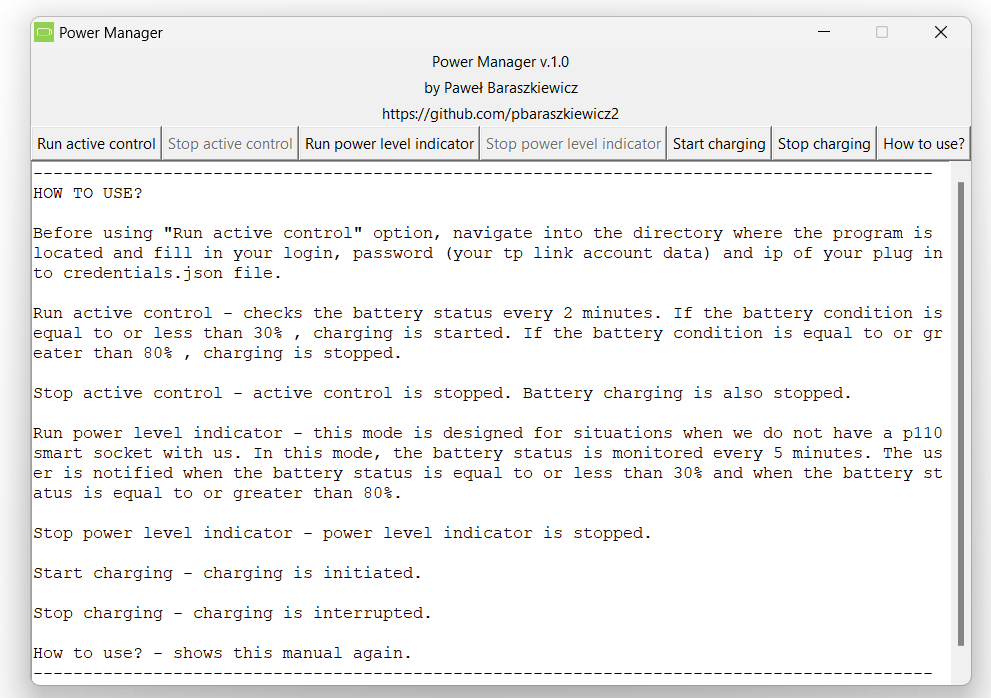
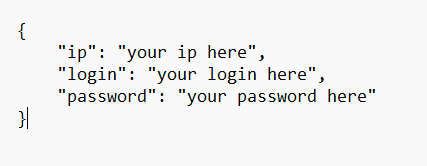

  

# Power Manager

Power Manager is a program designed to work with Tapo P110 plugs. It is used to maintain the optimal level of battery charge in a laptop, in order to prolong its life.

  

# Installation

I have uploaded python source code into this repo. You can download it, install all dependecnies and then run it on your OS. I know that it is running without any problems on Windows. I haven't tested it on Mac and Linux devices.

If you are a Windows user and want more convienent way to install a program, just download a zip file and extract a folder into a drive. Then you can run an exe file.

# How to use?

Before using "Run active control" option, navigate into the directory where the program is located and fill in your login, password (your tp link account data) and ip of your plug into credentials.json file.

  

Run active control - checks the battery status every 2 minutes. If the battery condition is equal to or less than 30% , charging is started. If the battery condition is equal to or greater than 80% , charging is stopped.

Stop active control - active control is stopped. Battery charging is also stopped.

Run power level indicator - this mode is designed for situations when we do not have a p110 smart socket with us. In this mode, the battery status is monitored every 5 minutes. The user is notified when the battery status is equal to or less than 30% and when the battery status is equal to or greater than 80%.

Stop power level indicator - power level indicator is stopped.

Start charging - charging is initiated.

Stop charging - charging is interrupted.

How to use? - shows this manual again.

# Support

If you found the program useful, please consider buying me a coffee :)

# Special thanks

Big thank you for
https://github.com/fishbigger . This program would not exists without https://github.com/fishbigger/TapoP100 .

# License

[MIT](https://choosealicense.com/licenses/mit/)
